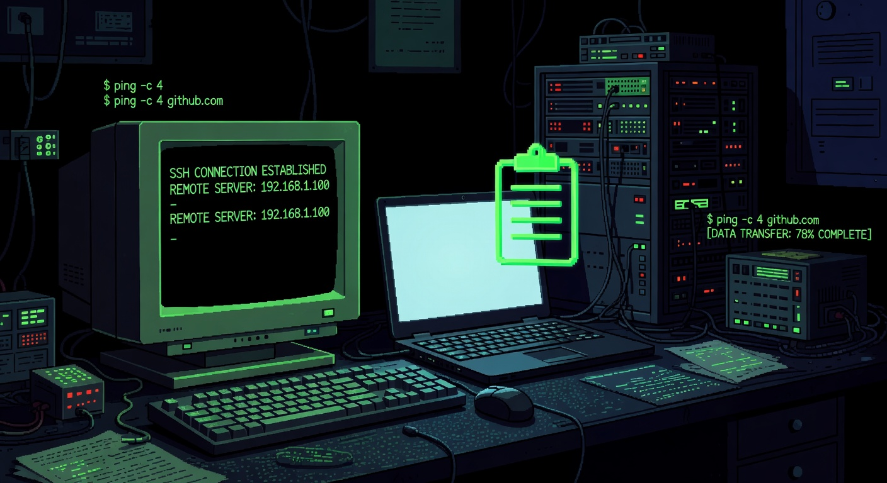

# PasteLocal



**Secure clipboard sharing over SSH for remote work and agentic coding tools.**

PasteLocal lets you access your local clipboard (including screenshots) from any remote machine over SSH — with zero friction. Built for developers who live in the terminal and use agentic coding tools.

---

## Why PasteLocal?

When you SSH into a remote machine (a VPS, server, or cloud instance), your local clipboard becomes unreachable. You take a screenshot or copy important text on your laptop, switch to your terminal, and suddenly you can't paste it into your agentic coding tool (Claude, Cursor, etc.) running on the remote.

This friction is especially painful for developers who rely on AI coding assistants over SSH.

**PasteLocal solves this cleanly:**

- Works over your existing SSH connection — no new ports or services exposed
- Extremely simple remote command (`pastelocal-remote`)
- Excellent integration with agentic coding tools via skills (`/paste`, `/paste-history`, etc.)
- Built-in clipboard history and named snippets
- Works with popular SSH clients like Termius

It’s the most reliable way today to bring your local clipboard into remote development environments.

---

## 60-Second Quick Start

The easiest way to get started:

```bash
# 1. Build from source (most reliable method for v0.1.0)
git clone https://github.com/Zen-Open-Source/PasteLocal.git
cd PasteLocal
make build

# 2. Initialize the local daemon
./bin/pastelocal init

# 3. Add your remote host (automatically sets up SSH forwarding)
./bin/pastelocal add-host myserver

# 4. On the remote server, pull your local clipboard
./bin/pastelocal-remote
```

`pastelocal-remote` will save your latest clipboard content (including screenshots) to a file on the remote machine and print the path. You can then read it with your agentic coding tool.

---

## Features

### Core Workflow
- One-command remote clipboard access via SSH tunnel
- Full support for images (screenshots) and text
- Works with any SSH client (including Termius)

### Integration with Agentic Coding Tools
- `/paste` — Paste current clipboard
- `/paste-history` — Choose from recent clipboard entries (or use the new `/recall` skill for natural-language semantic search)
- `/paste-snippet` — Recall saved named snippets
- `/paste-send` — Send files from the remote machine back to your local clipboard
- `/recall` — Natural language search over history (Recall v1)

### Productivity Tools
- **Clipboard History** — Go back in time with `pastelocal-remote --list` or the powerful `--search "natural language query"` (Recall v1)
- **Named Snippets** — Save frequently used text or images locally
- **TUI Dashboard** — Run `pastelocal` to see daemon status, hosts, and recent activity
- **Doctor** — `pastelocal doctor --fix` automatically diagnoses and repairs most issues

### Security & Privacy
- **Concealed / Sensitive Clipboard Filtering**: When the clipboard watcher is enabled (`watch.enabled = true`), PasteLocal automatically skips items marked as secrets by password managers. On macOS this uses the standard `org.nspasteboard.ConcealedType` signal (the same one Raycast and other good clipboard managers respect). These items are never relayed to remotes. Explicit access returns error `CB1013`. The feature is on by default for safety. See `[watch.sensitive]` in RELAY.md for configuration and detector-failure logging.

- **VisionPaste / Intelligent Screenshot Context (v1)**: Optional local analysis pipeline (`[vision]` in config.toml) that runs external commands (tesseract etc.) on screenshots **at explicit read time** on the serving daemon. Produces OCR text + descriptions included in `/clipboard` (and `/clipboard/history/{id}`) responses and written as `.analysis.txt` sidecars by `pastelocal-remote`. Skills present the rich text first. 
  - v1 limitations (by design, per scoped plan): Analysis is demand-driven on read (not pre-computed in watcher goroutine); relay carries raw bytes only; history stores raw bytes (re-analysis occurs on history fetch if still present on source clipboard). Concealed items never analyzed.
  Configure example:
  ```toml
  [vision]
  enabled = true
  [[vision.chain]]
  name = "ocr"
  command = "tesseract - - 2>/dev/null || true"
  ```

- **Recall v1 (Natural Language History Search)**: Semantic search over clipboard history using user-supplied embedding commands (Ollama, local Python, etc.). Query with `pastelocal-remote --search "the docker error from last night"` or the `/recall` skill. Results are ranked by cosine similarity over text content (and VisionPaste OCR+description for screenshots — the killer combo). 
  - Privacy: Concealed items are never embedded or returned. Embeddings live only in memory (lost on daemon restart in v1).
  - Enable with a 3-line config block + one of the ready-made scripts in `docs/examples/`.
  - Example (Ollama + nomic-embed-text, copy the script too):
    ```toml
    [recall]
    enabled = true
    timeout_seconds = 30
    command = "python3 -u ~/.config/pastelocal/embed_ollama.py"
    ```
  - Then from any agent: `pastelocal-remote --search "..." --limit 5` and fetch winners with `--id <id>`.

### Multi-Device Relay (v1.0)
- **Multi-device Relay** — E2E encrypted clipboard sync without SSH tunnels (see RELAY.md for full details, including sensitive clipboard filtering for password managers).

---

## Installation

### Download Pre-built Binary (Easiest)

Download the latest release for your platform from the [Releases page](https://github.com/Zen-Open-Source/PasteLocal/releases).

### Build from Source (Recommended)

```bash
git clone https://github.com/Zen-Open-Source/PasteLocal.git
cd PasteLocal
make build
```

The binaries will be in the `bin/` directory.

### Go Install

```bash
go install github.com/Zen-Open-Source/PasteLocal/cmd/pastelocal@latest
```

> **Note:** Due to a pending module path update, `go install` may not work reliably yet. We plan to support it properly in a future release. For now, downloading a release or building from source is recommended.

---

## Usage Examples

### Basic Remote Clipboard

```bash
# On your remote server
pastelocal-remote
# → /home/user/.cache/pastelocal/pastelocal-abc123.png
```

### Using with Agentic Coding Tools

The easiest way to use PasteLocal inside tools like Claude, Cursor, Windsurf, and others is to add a custom command/skill.

**Recommended prompt to add:**

```markdown
You have access to the user's local clipboard via PasteLocal.

To retrieve the latest clipboard content (including screenshots):

1. Run the command `pastelocal-remote` in the terminal on this remote machine.
2. It will output a file path (e.g. `~/.cache/pastelocal/pastelocal-xxx.png`).
3. Use your Read tool on that exact file path.
4. After reading the file, run `rm <path>` to clean it up.

Confirm to the user once you've received the clipboard content.
```

This works reliably with most agentic coding tools.

### Clipboard History

```bash
pastelocal-remote --list
pastelocal-remote --list --index 3
# or semantic search (requires [recall] enabled):
pastelocal-remote --search "the stack trace from the failed test"
pastelocal-remote --id <id-from-search>
```

### Named Snippets

On your local machine:

```bash
pastelocal snippets save api-key
pastelocal snippets save deploy-script --description "Common deploy command"
```

On the remote:

```bash
pastelocal-remote --snippet api-key
```

---

## Multi-Device Relay (v1.0)

PasteLocal has a **production-ready relay** (v1.0) that allows E2E-encrypted clipboard sharing between any number of devices without requiring direct SSH tunnels between every pair. See docs/RELAY.md for full setup, commands, and auto-sync configuration.

**Current Status:** v1.0 — persistence, per-peer encryption, CLI verbs, watcher auto-push, and Grok skills are complete and durable.

**Recommendation:** Use the SSH-based workflow for daily work. The relay is the recommended path for multi-device, cloud, or no-direct-tunnel scenarios.

---

## How It Works

```
Your Laptop                     Remote Server
┌──────────────┐               ┌─────────────────────┐
│ Local        │               │ Agentic Coding Tool │
│ Clipboard    │◄── SSH ───────│  pastelocal-remote  │
│              │   tunnel      │                     │
│ pastelocald  │               └─────────────────────┘
│ :7331        │
└──────────────┘
```

Everything travels over your existing encrypted SSH connection. No new ports are opened.

---

## Configuration

Configuration lives at `~/.config/pastelocal/config.toml`.

Key options:

```toml
[history]
enabled = true
size = 20
ttl_seconds = 3600

[relay]
enabled = false                    # v1.0 stable (opt-in)
relay_url = "http://localhost:7332"
auto_upload = false
```

Run `pastelocal` (the TUI) or `pastelocal doctor` to inspect your setup.

---

## Troubleshooting

Run this first:

```bash
pastelocal doctor --fix
```

Common issues and fixes are documented in the full docs:
- [Troubleshooting](docs/README.md#troubleshooting-top-10)
- [Error Codes](docs/ERROR_CODES.md)

---

## Contributing

Contributions are very welcome!

- Read [CONTRIBUTING.md](CONTRIBUTING.md)
- Check the [Architecture](docs/ARCHITECTURE.md) document
- Open an issue or pull request

We especially welcome improvements to the relay feature and better agentic coding tool integrations.

---

## Future Vision

PasteLocal already solves the core problem of reliably getting your local clipboard — especially screenshots — into remote agentic coding sessions over SSH.

That said, we have a bigger vision for what this experience could become.

The ideal workflow would feel almost native: paste an image directly in your SSH client (like Termius), have it automatically uploaded to the remote machine with a progress bar, and have the path instantly available in your agentic coding tool.

We see PasteLocal as the foundation for deeper, more seamless integrations with terminals, SSH clients, and agentic coding environments. If you're interested in helping push toward that future, we'd love to hear from you.

---

## Acknowledgments

This project was developed with significant assistance from **Grok Build** (xAI).  
Grok helped with architecture decisions, code reviews, documentation, release configuration, and polishing the project for public launch.

---

## License

MIT © Zen Open Source contributors

---

*Built out of frustration with constantly switching between local screenshots and remote terminals.*
